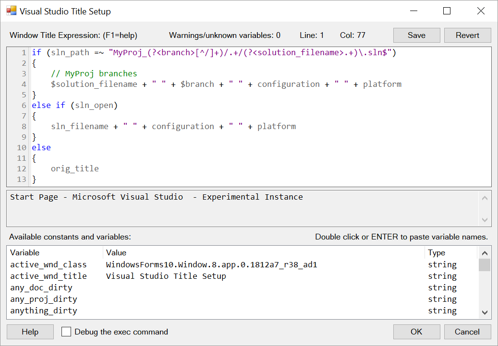

# vs-window-title-changer

This is a Visual Studio extension that allows you to set the VS titlebar using an expression.
The expression can use some of the internal state variables of Visual Studio
(e.g.: path of currently open solution file) to compose the title string.

## Installation

You have several options to install this extension:
- In the `Tools | Extensions and Updates...` menu of VS studio search online
  for the "Visual Studio Window Title Changer" extension.
  It's enough to put "title changer" to the search box.
- [Download from the Visual Studio Gallery](https://visualstudiogallery.msdn.microsoft.com/2e8ebfe4-023f-4c4d-9b7a-d05bbc5cb239) 
- [Download from the release section of this repo](https://github.com/pasztorpisti/vs-window-title-changer/releases)

## Usage and help

After installing the plugin go to the `Tools | Options... | VS Window Title Changer` options.
Select the `Window Title Setup` row and click the `...` button when it appears.
This should pop up the title setup window where you can enter your window title expression.

While the title expression setup window is open you can press F1 to read the help.
Alternatively you can read the same help [here](http://htmlpreview.github.io/?https://github.com/pasztorpisti/vs-window-title-changer/blob/master/Forms/TitleSetupEditorHelp.html).

## Development

The code and solution files for VS2005, VS2008 and VS2010 can be found in the
[pre-vs2017 branch](https://github.com/pasztorpisti/vs-window-title-changer/tree/pre-vs2017).
